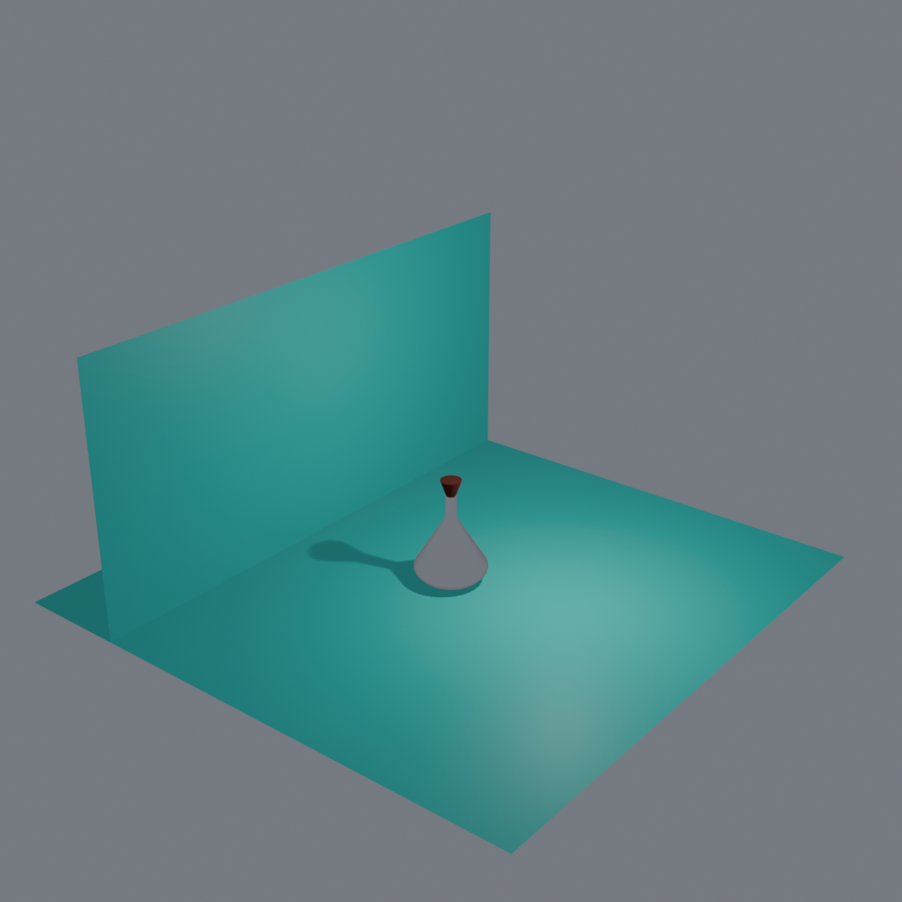

# blender-potion

Flacon à potion magique (blockout). Verre translucide, bouchon, liquide coloré et socle. Asset de base pour le système d'objets consommables d'Aetheria-Frontier.

> Asset extrait du projet **Aetheria-Frontier** (univers de Primea).

## Aperçu



## Détails du modèle

| Propriété | Valeur |
|-----------|--------|
| Fichier Blender | `potion.blend` |
| Meshes | 4 |
| Vertices | 780 |
| Faces (tris/quads) | 683 |
| Matériaux | Potion, bouchon, fond, verre |

## Structure du dépôt

```
blender-potion/
├── potion.blend   # source Blender (blockout)
├── preview.png   # rendu d'aperçu 1024x1024
├── README.md
└── .gitignore    # ignore les sauvegardes *.blend1
```

## Remarques

- Modèle de **blockout** : topologie et matériaux destinés à la pré-production / au greyboxing.
- Aperçu : capture écran réalisée par l.auteur dans Blender.
- Les fichiers `*.blend1` de sauvegarde automatique sont exclus du versioning.

## Licence

Propriété de Utopia Software Entertainment — usage interne au projet Aetheria-Frontier.
